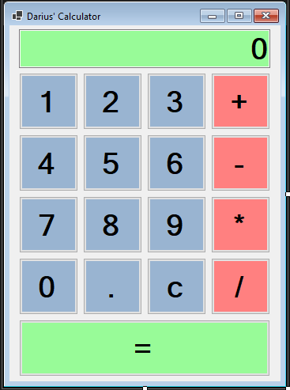

## 🧮 Calculator Java Project (Developed with Visual Basic UI)

 

### 📋 Description

This project is a simple calculator application built using Java for the backend logic and Visual Basic for the user interface (UI). It performs basic arithmetic operations such as addition, subtraction, multiplication, and division.

### 🚀 Features

* User-friendly Visual Basic interface
* Performs basic operations: `+`, `-`, `×`, `÷`
* Real-time calculation results
* Error handling for division by zero and invalid inputs

### 🛠️ Technologies Used

* **Java** – for handling the calculation logic
* **Visual Basic** – for creating the graphical user interface (GUI)
* **Visual Studio** – development environment

### 🖼️ Screenshot

Add your project screenshot below by replacing the image path:

 

### 🧰 How to Run the Project

1. Clone or download this repository.
2. Open the Visual Basic solution in **Visual Studio**.
3. Ensure that the Java runtime environment (JRE) is installed and configured properly.
4. Link the Java backend logic with the VB frontend (via command line calls, REST APIs, or JNI depending on your setup).
5. Build and run the project from Visual Studio.

### 📁 Project Structure (Example)

/CalculatorProject
├── /images
│   └── calculator.PNG
├── /src
│   └── Calculator.java
├── /vb-ui
│   └── CalculatorForm.vb
└── README.md

### 🙋‍♂️ Author

Created by **DENNIS DARIUS MUKOYA** – feel free to reach out for collaboration or suggestions!

### 📃 License

This project is licensed under the [MIT License](LICENSE).

